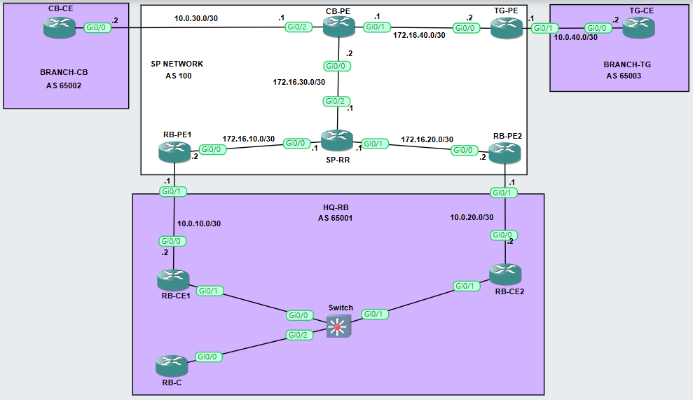

# MPLS L3VPN with Route Reflector and Load Balancing - GNS3 Lab 🛠️

**Author**: El Mahdi ARFAL  
**Academic Year**: 2025/2026  
**Institution**: Institut National des Postes et Télécommunications

## 🚀 Project Overview

This GNS3 lab demonstrates an advanced MPLS L3VPN implementation with multiple customer sites, Route Reflector (RR) architecture, and path load balancing capabilities. The project showcases a real-world Service Provider (SP) network connecting multiple enterprise branches with different Autonomous Systems (AS) through a robust MPLS backbone.

### ✅ Key Achievements
- **MPLS L3VPN** implementation connecting multiple customer sites
- **Route Reflector** deployment for scalable iBGP routing
- **Load balancing** across multiple paths
- **Multi-AS** environment with different customer networks
- **VRF** isolation and VPNv4 route distribution
- **BGP** as PE-CE Routing Protocol
- **OSPF** as SP IGP

## ⚠️ Why This Lab
Load balancing traffic is crucial for:
- **Bandwidth optimization** - Utilizing multiple available paths
- **Redundancy** - Automatic failover if one path fails
- **Performance** - Distributing traffic to prevent congestion
- **Cost efficiency** - Maximizing existing infrastructure

## 🌐 Topology

### Core Components
- **PE Routers**: RB-PE1, RB-PE2, CB-PE, TG-PE (Provider Edge)
- **CE Routers**: RB-CE1, RB-CE2, CB-CE, TG-CE (Customer Edge)
- **Route Reflector**: SP-RR
- **Core Switch**: SW for VLAN connectivity
- **Customer Router**: RB-C for internal routing

## ✅ Objectives & Learning Outcomes

### Primary Objectives
1. Implement MPLS L3VPN across multiple customer sites
2. Configure Route Reflector for scalable MP-BGP
3. Establish load balancing across multiple paths
4. Demonstrate VRF-aware routing with RD/RT
5. Configure inter-AS connectivity using eBGP

### Learning Outcomes
- Understanding MPLS VPN architecture and components
- Route Reflector design and implementation
- MP-BGP VPNv4 route distribution
- VRF configuration and route target communities
- Load balancing techniques in MPLS networks
- OSPF as IGP in MPLS backbone
- BGP as PE-CE Routing Protocol
- LDP for label distribution

## 🚀 Project Summary

This lab creates a comprehensive Service Provider network connecting four customer sites:
- **Two HQ SP Connections** (RB-CE1, RB-CE2)
- **Branches** (CB-CE, TG-CE) for extended connectivity
- **Route Reflector** (SP-RR) centralizing VPNv4 route distribution
- **Load balancing** achieved through multiple paths and eibgp maximum-paths

## ⚠️ Requirements

### Software & Tools
- **GNS3** & GNS3 VM
- **VMware Workstation/Player** or **VirtualBox**
- **Cisco IOSv 15.9(3)M9** image: `vios-adventerprisek9-m.spa.159-3.m9`

### Hardware Recommendations
- **RAM**: 8GB minimum
- **CPU**: 2 cores minimum
- **Storage**: 20GB free space

## 🌍 Addressing Plan

### MPLS Core Network (OSPF Area 0)
| Device | Interface | IP Address | Subnet Mask |
|--------|-----------|------------|-------------|
| SP-RR  | Lo0       | 172.16.0.1 | 255.255.255.255 |
| RB-PE1 | Lo0       | 172.16.1.1 | 255.255.255.255 |
| RB-PE2 | Lo0       | 172.16.2.1 | 255.255.255.255 |
| CB-PE  | Lo0       | 172.16.3.1 | 255.255.255.255 |
| TG-PE  | Lo0       | 172.16.4.1 | 255.255.255.255 |

### PE-CE Connections
| Connection      | PE IP     | CE IP     | Subnet |
|------------     |-------    |-------    |--------|
| RB-PE1 ↔ RB-CE1 | 10.0.10.1 | 10.0.10.2 | /30    |
| RB-PE2 ↔ RB-CE2 | 10.0.20.1 | 10.0.20.2 | /30    |
| CB-PE ↔ CB-CE   | 10.0.30.1 | 10.0.30.2 | /30    |
| TG-PE ↔ TG-CE   | 10.0.40.1 | 10.0.40.2 | /30    |

### Customer Networks
- **VLAN 11**: 192.168.11.0/24
- **VLAN 12**: 192.168.12.0/24
- **Loopbacks**: Various 10.0.x.1/32 addresses

## 🔧 Verification Commands

### MPLS & LDP Verification
#### Check MPLS interfaces
`show mpls interfaces`

#### Verify LDP neighbors
`show mpls ldp neighbor`

#### Check LDP bindings
`show mpls ldp bindings`

#### Verify label forwarding table
`show mpls forwarding-table`

### BGP & VPNv4 Verification
#### Check BGP neighbors
`show bgp vpnv4 unicast all neighbors`
`show bgp vpnv4 unicast all summary`

#### Verify VPNv4 routes
`show bgp vpnv4 unicast all`

#### Check VRF-specific routes
`show bgp vpnv4 unicast vrf CUST-A`

#### Verify route reflector clients
`show bgp vpnv4 unicast all neighbors | include Route-Reflector`

### VRF & Routing Verification
#### Verify VRF configuration
`show vrf detail`

#### Check VRF routing table
`show ip route vrf CUST-A`

#### Verify CEF for VRF
`show ip cef vrf CUST-A`

#### Check VRF interfaces
`show ip interface brief | include VRF`

### OSPF Verification
#### Verify OSPF neighbors
`show ip ospf neighbor`

#### Check OSPF database
`show ip ospf database`

#### Verify OSPF routes
`show ip route ospf`

### Load Balancing Verification
#### Check load balancing paths
`show ip route vrf CUST-A`
`show ip cef vrf CUST-A <destination-ip> detail`

#### Verify BGP multipath
`show bgp vpnv4 unicast vrf CUST-A <prefix>`

### End-to-End Connectivity Tests
#### From CE routers, test connectivity across VPN
`ping vrf CUST-A <remote-CE-ip>`
`traceroute vrf CUST-A <remote-CE-ip>`

## ⚙️ How to Import and Run in GNS3

### Installation Steps

#### Import Project File
1. Open GNS3
2. Go to `File > Import Project`
3. Select `MPLS-LVPN--RR.gns3project`
4. Choose import location

#### Configure IOS Image
- Ensure Cisco IOSv image is available in GNS3
- Update device templates if necessary
- Verify image compatibility with `vios-adventerprisek9-m.spa.159-3.m9`

#### Start the Lab
1. Open the project
2. Start all devices
3. Allow 2-3 minutes for OSPF, LDP, and BGP convergence

### Initial Configuration Check
- Verify all physical interfaces are UP
- Check OSPF adjacencies are established
- Confirm LDP sessions are active
- Validate BGP neighbor relationships

## 📚 Notes

### Important Considerations
- **Convergence Time**: Allow sufficient time for protocol convergence (2-5 minutes)
- **Route Reflector**: SP-RR is critical for VPNv4 route distribution
- **Load Balancing**: Configured using `maximum-paths eibgp 2` on PE routers
- **VRF Consistency**: Ensure route targets match across all PEs for proper route distribution

## Devices Used

| Device         | Role            | Function |
|--------        |------           |----------|
| RB-PE1, RB-PE2 | Provider Edge   | Customer connectivity, VRF instances |
| CB-PE, TG-PE   | Provider Edge   | Additional customer sites |
| SP-RR          | Route Reflector | Centralized BGP route reflection |
| RB-CE1, RB-CE2 | Customer Edge   | Branch routers with VLANs |
| CB-CE, TG-CE   | Customer Edge   | Additional customer routers |
| SW             | Layer 2 Switch  | VLAN trunking between devices |
| RB-C           | Customer Router | Internal routing for VLANs |

## Features Implemented

### Core Features
- ✅ MPLS L3VPN with multiple VRFs
- ✅ MP-BGP VPNv4 route distribution
- ✅ Route Reflector for scalable iBGP
- ✅ OSPF as MPLS backbone IGP
- ✅ LDP for label distribution

### Advanced Features
- ✅ Load balancing with eibgp multipath
- ✅ Multi-AS eBGP PE-CE routing
- ✅ VLAN integration with 802.1Q trunking
- ✅ Route filtering with route-target communities
- ✅ Soft reconfiguration for BGP policies

## Protocols & Technologies

### Layer 3 Protocols
- **BGP** (eBGP for PE-CE, iBGP for PE-RR)
- **MP-BGP** (VPNv4 address family)
- **OSPF** (MPLS backbone IGP)

### MPLS Technologies
- **MPLS L3VPN** (VRF, RD, RT)
- **LDP** (Label Distribution Protocol)
- **Route Reflector** (for VPNv4 routes)

### Switching & VLAN
- **802.1Q** VLAN trunking
- **VLAN** segmentation (11, 12)
- **Layer 2 switching**

### Routing Features
- **Route Targets** (import/export)
- **Route Distinguishers** (per VRF)
- **Load Balancing** (eibgp multipath)
- **Prefix Advertisement** (network statements)
